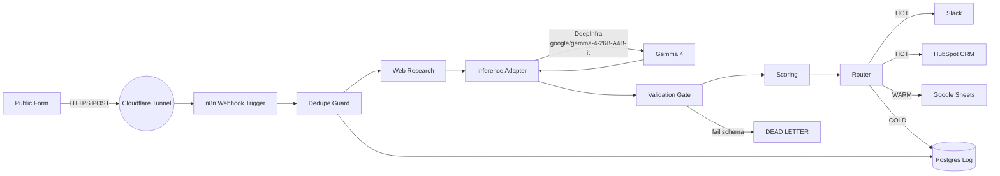

# Intake-to-Outbound Pipeline

[](https://github.com/jakemorganlabs/intake-n-outbound.pipeline/actions/workflows/evals.yml)


Lead-intelligence pipeline. One webhook submission in, deterministic score and tiered outbound action out. The model is allowed exactly one structured extraction call per lead; its output is validated against a JSON Schema before anything downstream sees it.

```
Public endpoint: https://intake.jakemorganlabs.dev/webhook
Rate limit: 60 req / min per IP.
```

## What it does

A form submission arrives via webhook. The pipeline dedupes it, runs a brief web-research query, makes a single structured call to Gemma 4 26B on DeepInfra for firmographic and intent signals, scores the result with fixed rules, and routes the lead to one of three tiers:

- **HOT**: Slack alert + HubSpot contact
- **WARM**: append to a Google Sheet for batch follow-up
- **COLD**: log only, no outbound

If the model output ever fails schema validation, the lead routes to **MANUAL** and the raw payload is preserved for human triage. The whole thing runs on one VPS behind a Cloudflare Tunnel that publishes exactly one path. No open inbound ports.

## Architecture



Single Hetzner VPS. Postgres and n8n as containers, a cloudflared sidecar that publishes only the webhook path, outbound HTTPS to five named APIs (DeepInfra, Brave Search, Slack, HubSpot, Google Sheets). The whole edge surface is one URL.

## Measured Bar

| Suite | Cases | Categories | Pass Rate | Gate |
|-------|-------|-----------|-----------|------|
| S04 Local | 33 | schema, routing, idempotency, degradation, injection, gibberish, multilingual | 100% (33/33) | CI gates `main` |
| S04 Prod | __AFTER_DEPLOY__ | same categories against live endpoint | __AFTER_DEPLOY__ | operator-reviewed |

Reports: [eval_report_local.md](docs/evidence/eval_report_local.md) | [eval_report_prod.md](docs/evidence/eval_report_prod.md)

## Security

- One public path. The tunnel exposes `https://intake.jakemorganlabs.dev/webhook` and 404s everything else. The n8n editor and the database have no public route.
- Secrets stay on the VPS in `deploy/.env.production`. `scripts/secret_gate.sh` runs as a pre-commit hook to block accidental commits.
- Nightly `pg_dump` with 7-day retention. Restore is tested against a scratch container by `deploy/restore.sh` before any real restore.

## Run it

```bash
cp .env.example .env
# fill DATABASE_URL, MODEL_API_KEY, SEARCH_API_KEY, WEBHOOK_SECRET

npm install
npm run migrate           # Postgres migrations
npm test                  # unit tests (offline)
npm run validate:schemas # JSON Schema checks
npm run smoke             # end-to-end acceptance
npm run eval              # eval suite (needs live API keys)
npm start                 # HTTP server on PORT (default 3001)
```

Production redeploy, migrations, secret rotation, and backup restore are in [`docs/runbook.md`](docs/runbook.md).

## Repo Map

```
deploy/         docker-compose, cron pg_dump, restore.sh, .env.production.example
src/
  pipeline.ts   9-stage orchestration spine
  server.ts     Hono webhook receiver
  scoring.ts    deterministic composite scoring
  router.ts     confidence-aware tier routing
  idempotency.ts stable key derivation
  adapters/     Slack, HubSpot, Sheets, DLQ
evals/          run.ts + 33 fixtures across 7 categories
workflows/      n8n exports (intake_main, intake_error)
schemas/        inference_output.schema.json, canonical_lead.schema.json
scripts/        secret_gate, smoke, validate-schemas, metrics, cost
migrations/     6 SQL migrations
docs/           runbook, evidence/
```

## Docs

- [docs/runbook.md](docs/runbook.md): production redeploy, migrate, rotate, restore.
- [docs/evidence/](docs/evidence/): committed eval, smoke, and posture proof.
- [SRS/TDD](docs/intake_outbound_pipeline_srs_tdd.html): the controlled document this build implements (Rev 1.0, baselined). GitHub serves committed HTML as raw source; a rendered copy is hosted at the portfolio site.

## Portfolio

Piece I of a five-piece set: containment (one schema-checked extraction, deterministic core, bounded adapters).

Sibling repos: `document-intelligence-rag` (II), `shovels_n8n_nodes` (III), `recon_multiagent` (IV), `fieldops` (capstone, link when public). Each repo links its siblings. The capstone reuses this piece's contained intake extraction as its intake stage.

## Author

**jakemorganlabs**
- Portfolio: https://jakemorganlabs.dev
- LinkedIn: https://www.linkedin.com/in/jakemorganlabs
- Contact: jakemorganlabs@gmail.com