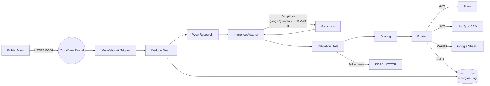

# Intake-to-Outbound Intelligence Pipeline

[](https://github.com/jakemorganlabs/intake-n-outbound.pipeline/actions/workflows/evals.yml)


> A contained lead-intelligence pipeline: one webhook submission → web research → contained model inference → deterministic scoring → tiered outbound routing. The model is allowed exactly one structured extraction call per lead; its output is validated against a strict JSON Schema before it is permitted to influence anything downstream.

```
v1.0.0 — deployed and live
Public endpoint: https://intake.jakemorganlabs.dev/webhook
Rate limit: 60 requests / minute per IP. Misuse is logged.
```

---

## What it does

A public form submission arrives via webhook. The pipeline deduplicates it, runs a brief web research query, asks a single structured-language-model call (Google Gemma 4 26B via DeepInfra) to extract firmographic and intent signals, scores the result with deterministic rules, and routes the lead to one of three tiers:

- **HOT**: Instant Slack alert + CRM contact creation
- **WARM**: Appended to a Google Sheet for batch follow-up
- **COLD**: Logged only. No outbound action.

If the model's output ever fails schema validation, it is routed to **MANUAL** and the raw payload is preserved for human triage. The entire system lives on a single VPS, behind a Cloudflare Tunnel that publishes exactly one path. No open inbound ports.

---

## Architecture



The deployment topology is small and deliberate: a single Hetzner VPS, Postgres and n8n as containers, a cloudflared sidecar that publishes only the webhook path, and outbound HTTPS to five named APIs (DeepInfra, Brave Search, Slack, HubSpot, Google Sheets). The whole edge surface area is one URL.

---

## The Measured Bar

| Suite | Cases | Categories | Latest Pass Rate | Gate |
|-------|-------|-----------|------------------|------|
| S04 Local | 33 | schema, routing, idempotency, degradation, injection, gibberish, multilingual | 100% (33/33) | CI gates `main` |
| S04 Prod | __AFTER_DEPLOY__ | Same categories against live endpoint | __AFTER_DEPLOY__ | Operator-reviewed |

Reports: [eval_report_local.md](docs/evidence/eval_report_local.md) | [eval_report_prod.md](docs/evidence/eval_report_prod.md)

---

## Security Posture

- **One public path:** The Cloudflare Tunnel exposes `https://intake.jakemorganlabs.dev/webhook` and returns 404 for everything else. The n8n editor and the database are unreachable from the internet.
- **Secrets never in the repo:** All credentials live in `deploy/.env.production` on the VPS. `scripts/secret_gate.sh` runs as a pre-commit hook to block accidental commits of secrets. See [`scripts/secret_gate.sh`](scripts/secret_gate.sh).
- **Earned recovery:** Nightly `pg_dump` with 7-day retention; restore is tested against a scratch container via `deploy/restore.sh`.

---

## Run it yourself

### Local quickstart

```bash
cp .env.example .env
# edit .env with DATABASE_URL, MODEL_API_KEY, SEARCH_API_KEY, WEBHOOK_SECRET

npm install
npm run migrate                # Postgres migrations
npm test                       # unit tests (offline)
npm run validate:schemas       # JSON Schema checks
npm run smoke                  # end-to-end acceptance test
npm run eval                   # eval suite (requires live API keys)
npm start                      # HTTP server on PORT (default 3001)
```

### Production

See [`docs/runbook.md`](docs/runbook.md): exact commands for redeploy, migrations, secret rotation, and backup restore. A second person could redeploy from it without help.

---

## Repo Map

```
├── deploy/
│   ├── docker-compose.yml              # n8n + postgres + cloudflared sidecar
│   ├── .env.production.example         # every env var documented, all __REPLACE_ME__
│   ├── cron/pg_dump.sh                 # nightly backup + retention
│   └── restore.sh                      # test restore into scratch container
├── src/
│   ├── pipeline.ts                     # full 9-stage orchestration spine
│   ├── server.ts                       # Hono webhook receiver
│   ├── scoring.ts                      # deterministic composite scoring
│   ├── router.ts                       # confidence-aware tier routing
│   ├── idempotency.ts                  # stable key derivation
│   └── adapters/                       # Slack, HubSpot, Sheets, DLQ
├── evals/
│   ├── run.ts                          # eval runner (EVAL_ENV=prod aware)
│   └── fixtures/                       # 33 synthetic eval cases across 7 categories
├── workflows/
│   ├── intake_main.json                # n8n workflow export
│   └── intake_error.json               # dedicated error workflow
├── schemas/
│   ├── inference_output.schema.json    # strict validation gate
│   └── canonical_lead.schema.json      # persisted lead contract
├── scripts/
│   ├── secret_gate.sh                  # pre-commit secret scanner
│   ├── hooks/pre-commit                # committed hook → make hooks
│   ├── smoke.ts                        # local acceptance test
│   └── smoke_prod.sh                   # external smoke against live URL
├── docs/
│   ├── runbook.md                      # operator reference
│   ├── evidence/                       # committed proof slots (closeout-evidence branch)
│   ├── intake_outbound_pipeline_srs_tdd.html  # SRS/TDD v1.0 baselined
│   └── MICT-PIPE-001-S05_deployment.html     # Session 5 build plan
└── migrations/                         # 6 SQL migrations
```

---

## Docs Index

| Document | What it is |
|----------|-----------|
| [SRS/TDD](https://__OPERATOR__PORTFOLIO_URL__/intake_outbound_pipeline_srs_tdd.html) | Controlled document this build implements (Rev 1.0, baselined) |
| [docs/runbook.md](docs/runbook.md) | Production redeploy, migrate, rotate, restore commands |
| [docs/evidence/](docs/evidence/) | Committed proof: evals, smoke, posture |

> Note on the SRS/TDD: GitHub serves committed HTML as raw source. The canonical copy is in `docs/intake_outbound_pipeline_srs_tdd.html`; a rendered version is hosted at the portfolio site.

---

## Part of a five-piece portfolio

> This is **Piece I** — containment: one schema-checked extraction, deterministic core, bounded adapters.
>
> Piece II `document-intelligence-rag` · Piece III `shovels_n8n_nodes` · Piece IV `recon_multiagent` · Capstone `fieldops` (link when public)
>
> Every repo links its siblings; a reviewer landing anywhere discovers the system. FIELD-005 explicitly reuses this piece's discipline: its contained intake extraction becomes the capstone's intake stage.

---

## Author

**jakemorganlabs**
- Portfolio: `__OPERATOR_URL__`
- LinkedIn: `__OPERATOR_URL__`
- Contact: `__OPERATOR_EMAIL__`
