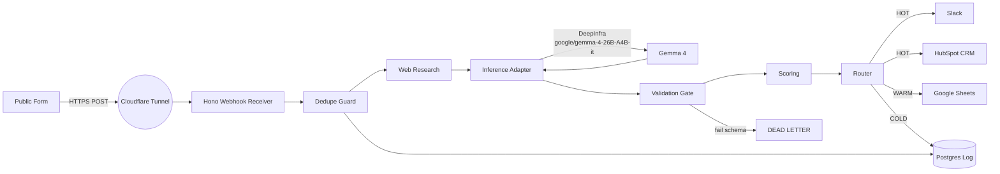

# Intake-to-Outbound Pipeline

[](https://github.com/jakemorganlabs/intake-n-outbound.pipeline/actions/workflows/evals.yml)


Lead-intelligence pipeline. One webhook submission goes in. A deterministic score and a tiered outbound action come out. The model gets exactly one structured extraction call per lead. A JSON Schema gate validates the output before any downstream stage reads it.

```
Public endpoint: https://intake.jakemorganlabs.dev/intake-webhook
```

## What it does

1. A form submission arrives at the webhook.
2. The pipeline derives an idempotency key and drops duplicates.
3. A bounded web-research query runs.
4. One structured call goes to Gemma 4 26B on DeepInfra for firmographic and intent signals.
5. Fixed rules score the result.
6. The router assigns one of three tiers.

- **HOT**: Slack alert and a HubSpot contact.
- **WARM**: a row in a Google Sheet for batch follow-up.
- **COLD**: a log entry only. No outbound.

If the model output fails schema validation, the lead routes to **MANUAL**. The raw payload is preserved for human triage. The whole system runs on one VPS behind a Cloudflare Tunnel. The tunnel publishes exactly one path. There are no open inbound ports.

## Architecture


```mermaid
graph LR
    A[Public Form] -->|HTTPS POST| B((Cloudflare Tunnel))
    B --> C[Hono Webhook Receiver]
    C --> D[Dedupe Guard]
    D --> E[Web Research]
    E --> F[Inference Adapter]
    F -->|DeepInfra<br/>google/gemma-4-26B-A4B-it| G[Gemma 4]
    G --> F
    F --> H[Validation Gate]
    H --> I[Scoring]
    I --> J[Router]
    J -->|HOT| K[Slack]
    J -->|HOT| L[HubSpot CRM]
    J -->|WARM| M[Google Sheets]
    J -->|COLD| N[(Postgres Log)]
    D --> N
    H -->|fail schema| O[DEAD LETTER]
```

One Hetzner VPS. The pipeline is a TypeScript service (Hono) that systemd runs. Postgres runs on the host, loopback only. A standalone cloudflared service publishes only the webhook path; Cloudflare manages the tunnel from the dashboard. Outbound HTTPS goes to five named APIs: DeepInfra, Brave Search, Slack, HubSpot, Google Sheets. The whole edge surface is one URL.

**NOTE:** The `workflows/` directory holds n8n JSON exports from an earlier design pass. They are reference material only. They do not run the pipeline, and the pipeline does not need them. The TypeScript service is the source of truth.

## Measured bar

| Suite | Cases | Categories | Result | Gate |
|-------|-------|-----------|--------|------|
| Unit (offline, keyless) | 47 | adapters, scoring, routing, idempotency | 47/47 pass | CI gates `main` |
| S04 Local | 33 | schema, routing, idempotency, degradation, injection, gibberish, multilingual | 33/33 pass | CI gates `main` |
| Live path | 3 tiers | real submissions through the public endpoint | verified | operator-reviewed |

Report: [eval_report_local.md](docs/evidence/eval_report_local.md). The prod eval suite has not yet run against the live endpoint. The live-path row records end-to-end verification of each routing tier through the tunnel: HOT to Slack and HubSpot, WARM to the Sheet, COLD to Postgres.

## Security

- One public path. The tunnel exposes `/intake-webhook` and returns 404 for everything else. The database has no public route. The firewall permits no inbound connections. The tunnel is the only way in.
- Secrets stay on the VPS in `deploy/.env.production`. The file is not in git. `scripts/secret_gate.sh` runs as a pre-commit hook and blocks accidental commits.
- The Google service-account key is a local file. Git ignores it. The environment references it by path.
- A nightly `pg_dump` runs with 7-day retention. `deploy/restore.sh` tests each restore against a scratch container before any real restore.

## Run it

```bash
cp .env.example .env
# fill DATABASE_URL, MODEL_API_KEY, SEARCH_API_KEY, WEBHOOK_SECRET
# the WARM tier needs GOOGLE_APPLICATION_CREDENTIALS with a service-account JSON path

npm install
npm run migrate           # Postgres migrations
npm test                  # unit tests, offline and keyless
npm run validate:schemas  # JSON Schema checks
npm run smoke             # end-to-end acceptance
npm run eval              # eval suite, needs live API keys
npm start                 # HTTP server on PORT, default 3001
```

**NOTE:** There is no build step. The service runs the TypeScript directly. On the server, an edit takes effect only after `sudo systemctl restart intake-pipeline`.

Production redeploy, migrations, secret rotation, and backup restore are in [`docs/runbook.md`](docs/runbook.md).

## Repo map

```
src/
  pipeline.ts    9-stage orchestration spine
  server.ts      Hono webhook receiver + Tally payload adapter
  scoring.ts     deterministic composite scoring
  router.ts      confidence-aware tier routing
  idempotency.ts stable key derivation
  adapters/      Slack, HubSpot, Sheets, DLQ
evals/           run.ts + 33 fixtures across 7 categories
workflows/       n8n exports, reference only (see Architecture note)
schemas/         inference_output.schema.json, canonical_lead.schema.json
scripts/         secret_gate, smoke, validate-schemas, metrics, cost
migrations/      6 SQL migrations
deploy/          cron pg_dump, restore.sh, .env.production.example
docs/            runbook, SRS/TDD, evidence/
```

## Docs

- [docs/SRS-TDD.md](docs/SRS-TDD.md): the controlled document this build implements, Rev 1.1 as built. The revision record lists each point where the deployed system moved off the 1.0 baseline.
- [docs/runbook.md](docs/runbook.md): production redeploy, migrate, rotate, restore.
- [docs/evidence/](docs/evidence/): committed eval, smoke, and posture proof.

## Portfolio

Piece I of a five-piece set: containment. One schema-checked extraction, a deterministic core, bounded adapters.

Sibling repos: `document-intelligence-rag` (II), `shovels_n8n_nodes` (III), `recon_multiagent` (IV), `fieldops` (capstone, link when public). Each repo links its siblings. The capstone reuses this piece's contained intake extraction as its intake stage.

## Author

**jakemorganlabs**
- Portfolio: https://jakemorganlabs.dev
- LinkedIn: https://www.linkedin.com/in/jakemorganlabs
- Contact: jakemorganlabs@gmail.com
